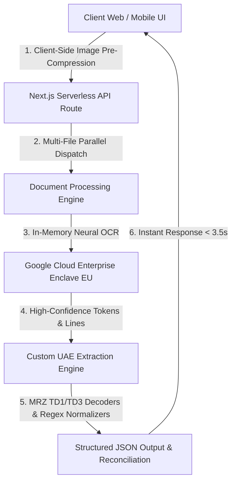

# UAE Document Intelligence Suite 🇦🇪

[](https://uae-document-reader.vercel.app/)
[](https://nextjs.org/)
[](https://www.typescriptlang.org/)
[](https://vercel.com/)
[](https://uae-document-reader.vercel.app/)

> **Enterprise-grade document verification engine engineered specifically for UAE car rentals, automotive dealerships, financial services, and identity onboarding.**

🔗 **Live Production Application:** [https://uae-document-reader.vercel.app/](https://uae-document-reader.vercel.app/)

---

## 🌟 Executive Overview

The **UAE Document Intelligence Suite** provides an end-to-end, automated document reading and cross-verification pipeline. It replaces manual data entry with instant, sub-4-second neural OCR extraction for UAE vehicle licenses, international passports, and UAE resident identities (Emirates ID + Driving Licence).

### Key Business Benefits
* **⚡ 90% Faster Customer Onboarding:** Reduces document intake time from minutes to under 3.5 seconds.
* **🎯 High Field Precision:** Employs specialized rule engines, Machine-Readable Zone (MRZ TD1 & TD3) decoders, and multi-lingual Arabic/English entity extractors.
* **🛡️ Zero-Retention Data Privacy:** Compliant with stringent data privacy standards. All documents are processed strictly in volatile RAM (In-Memory) without persistent disk storage.
* **📱 Multi-Page Concurrent Processing:** Concurrently analyzes up to 4 document sides (Emirates ID Front/Back & Driving Licence Front/Back) in parallel with automated cross-document reconciliation.

---

## 📑 Supported Document Modules

### 1. 🚗 UAE Vehicle License (الملكية - Mulkiya)
Full support for registration cards across all **7 Emirates** (Dubai RTA, Abu Dhabi Police, Sharjah, Ajman, RAK, Fujairah, UAQ):
* **Plate Details:** Source Emirate, Category (Private/Commercial), Plate Code, Plate Number.
* **Vehicle Specifications:** Make, Model, Model Year, Vehicle Color, Chassis Number (VIN).
* **Registration & Insurance:** Expiry Dates, Issuance Dates, Insurer Name, Insurance Policy Number.

### 2. 🛂 International Passport Reader (جواز السفر)
Validates and extracts global travel documents with strict ICAO 9303 compliance:
* **Standards:** Machine-Readable Zone (MRZ TD3 44×2 and TD2).
* **Extracted Data:** Passport Number, Full Name (Surname & Given Names), Nationality (ISO-3 & Name), Issuing Country, Date of Birth, Gender, Expiry Date.
* **Audit & Validation:** Real-time check-digit calculation and expiration warning flags (`VALID`, `EXPIRING_SOON`, `EXPIRED`).

### 3. 💳 UAE Resident Suite (Emirates ID + UAE Driving Licence)
Multi-document intake with automated identity reconciliation:
* **Emirates ID (Front & Back):**
  - MRZ TD1 (3-line) parser for high precision.
  - Emirates ID Number (`784-YYYY-XXXXXXX-X`), Card Number (9 digits), Arabic Name, English Name, Nationality, Date of Birth, Issue Date, Expiry Date, Occupation, Employer.
* **UAE Driving Licence (Front & Back):**
  - Licence Number, Traffic Code No. (الرمز المروري), Place of Issue (Dubai RTA, Ajman, Abu Dhabi, etc.), Issue Date, Expiry Date, Permitted Categories (`Light Vehicle (3)`, `Motorcycle (1)`, etc.).
* **Automated Cross-Check (Reconciliation):**
  - Instant name matching across identity and driving licence.
  - Multi-document validity audit with status indicators (`VERIFIED`, `NEEDS_REVIEW`, `DOCUMENT_EXPIRED`).

---

## 🏗️ Technical Architecture



---

## 🔌 API Reference

### Extract Document Data

```http
POST /api/extract
```

#### Option A: FormData (Multipart Upload)

| Parameter | Type | Required | Description |
|---|---|---|---|
| `doc_type` | `string` | Yes | `mulkiya` \| `passport` \| `residence` |
| `files` | `File[]` | Yes | One or multiple document images (JPEG, PNG, WebP, PDF) |

#### Example Request (cURL):

```bash
curl -X POST https://uae-document-reader.vercel.app/api/extract \
  -F "doc_type=residence" \
  -F "files=@emirates_id_front.jpg" \
  -F "files=@emirates_id_back.jpg" \
  -F "files=@driving_licence_front.jpg" \
  -F "files=@driving_licence_back.jpg"
```

#### Example Response (`residence` type):

```json
{
  "success": true,
  "doc_type": "residence",
  "emirates_id": {
    "id_number": "784-1999-5792517-7",
    "name_en": "Mohamad Hussain Darwish",
    "name_ar": "محمد حسين درويش",
    "nationality": "Syria (سورية)",
    "date_of_birth": "1999-05-27",
    "issue_date": "2026-07-20",
    "expiry_date": "2028-07-19",
    "card_number": "156340636",
    "occupation": "Marketing Manager",
    "employer": "First Super Car Rental L.L.C",
    "status": "VALID"
  },
  "driving_licence": {
    "licence_number": "382569",
    "traffic_code_no": "4240026439",
    "issued_by": "Ajman (عجمان)",
    "issue_date": "2024-08-21",
    "expiry_date": "2026-08-20",
    "categories": [
      "Light Vehicle (3)"
    ],
    "status": "VALID"
  },
  "reconciliation": {
    "name_match": true,
    "nationality_match": true,
    "all_valid": true,
    "overall_status": "VERIFIED",
    "review_reasons": []
  },
  "processing_time_ms": 3240
}
```

---

## 🔒 Security & Data Privacy

* **In-Memory Zero Retention:** Images and payloads exist only in RAM during processing and are discarded immediately after field extraction.
* **Encrypted European Enclave:** Document intelligence APIs operate within Google Cloud EU compliance boundaries.
* **No AI Retraining:** Enterprise privacy terms ensure customer document images are never stored or used to train public machine learning models.
* **Serverless Security:** Secret keys and cloud credentials are encrypted as environment variables and never exposed to the client browser.

---

## 💻 Local Development Setup

### 1. Clone & Install Dependencies
```bash
git clone https://github.com/aimodarwish/uae-document-reader.git
cd uae-document-reader
npm install
```

### 2. Configure Environment
Copy `.env.example` to `.env.local` and configure your credentials:
```bash
cp .env.example .env.local
```

### 3. Launch Development Server
```bash
npm run dev
```
Open [http://localhost:3000](http://localhost:3000) to view the application.

### 4. Build for Production
```bash
npm run build
npm run start
```

---

## 🚀 Vercel Deployment

1. Connect your repository to **[Vercel](https://vercel.com/)**.
2. Add the environment variables from `.env.example` under **Project Settings ➔ Environment Variables**.
3. Deploy!

---

## 🏢 Enterprise Support & Licensing

Developed for high-volume automotive and rental verification operations.

* **Live Demo:** [https://uae-document-reader.vercel.app/](https://uae-document-reader.vercel.app/)
* **Repository:** [https://github.com/aimodarwish/uae-document-reader](https://github.com/aimodarwish/uae-document-reader)
* **License:** Proprietary & Confidential.
